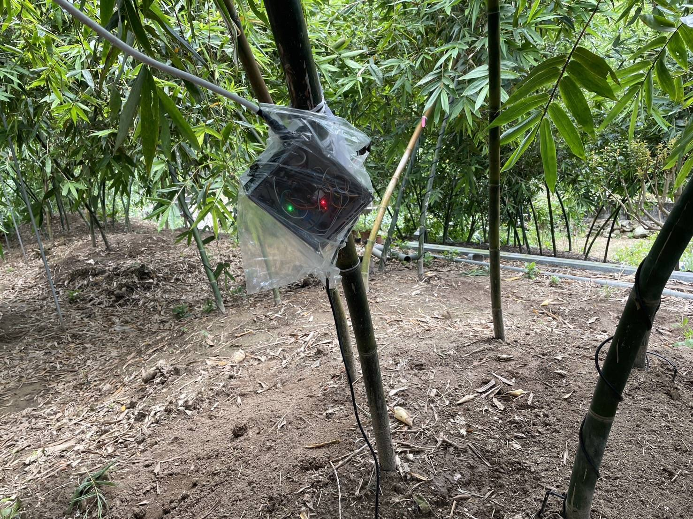
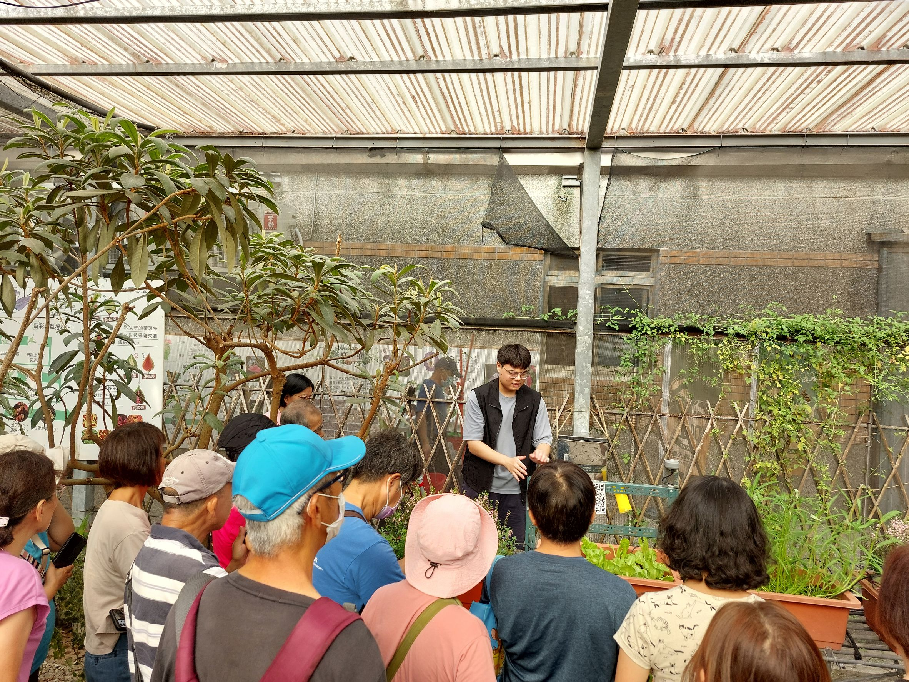

# Smart Irrigation System Based on Soil Moisture Sensing  
_Developed for Real-world Agricultural Deployment in Bamboo Shoot Fields_

---

  
*Figure 1: Field deployment in Wugu bamboo shoot farm using ESP32-based moisture sensing controller.*

---

## 🌱 Project Overview

This project presents the development of a **low-cost smart irrigation system** based on soil moisture sensing, aiming to improve water use efficiency (WUE) in agricultural settings. The system was deployed in a bamboo shoot farm located in Wugu District, New Taipei City, and evaluated over two months under real-world conditions.

The system automates irrigation based on real-time soil moisture values, allowing farmers to remotely monitor and control irrigation thresholds via a local Wi-Fi interface, even in areas with no internet access.

---

## 🔧 System Architecture

| Component                     | Description                                               |
|------------------------------|-----------------------------------------------------------|
| **ESP32**                    | Main microcontroller unit (NodeMCU-ESP32-S)               |
| **Capacitive Soil Moisture Sensor (DFRobot)** | Measures soil moisture to trigger irrigation |
| **DHT22**                    | Senses temperature and humidity                          |
| **DS3231 RTC Module**        | Provides timestamps for data logging                     |
| **MicroSD Card Module**      | Stores historical environmental data and pump logs       |
| **Wi-Fi Access Point (ESP32)** | Hosts a local control webpage for real-time interaction |
| **Water Pump**               | Controlled via soil moisture threshold                   |

---

## 🌐 Control Center Features

- Local Wi-Fi hotspot hosted by the ESP32 microcontroller
- Web-based dashboard accessible via any mobile device
- Features:
  - View real-time soil moisture and environmental data
  - Adjust moisture threshold value
  - View historical logs saved on the SD card

> 💡 Designed for **offline operation** in regions without network coverage

---

## 🧪 Field Deployment

- **Location**: Bamboo shoot farm in Wugu District, New Taipei City, Taiwan  
- **Area**: 220 square meters  
- **Setup**:
  - Divided into two plots:
    - **Smart Irrigation** (auto control via moisture sensor)
    - **Manual Irrigation** (by farmer's experience)
  - Nine bamboo clusters in each plot
- **Duration**: 2 months  
- **Irrigation Method**: Water drawn from tower via PE pipes to drip irrigation at root zone

---

## 📊 Results

| Control System     | Moisture Threshold (%VMC) | Yield (kg) | Water Usage (m³) | WUE (kg/m³) |
|--------------------|----------------------------|------------|------------------|-------------|
| Manual Irrigation  | N/A                        | 55.16      | 17.65            | 3.1         |
| Smart Irrigation   | 50%                        | 56.88      | 14.47            | 3.9         |

- WUE improved by **~25%** using the smart irrigation system
- Yield difference was minor and not statistically significant
- Smart system responded dynamically, triggering shorter but more frequent irrigation events
- Manual system tended to irrigate in large quantities less frequently

---

## ⚠️ Observations & Challenges

- Heavy rainfall and typhoons during the test period tested system durability
- Waterproofing improved hardware stability but slightly reduced sensor accuracy (notably DHT22 readings)
- Trade-off between sensing accuracy and hardware protection remains an area for optimization

---

## ✅ Post-Project Outreach

After field testing, the smart irrigation controller was introduced to local farmers during an outreach session hosted at National Taiwan University, aiming to promote the adoption of practical, low-cost automation solutions in agriculture.

  
*Figure 2: Project member presenting the irrigation controller to farmers during a demo session at NTU.*

---

## ✅ Conclusion

This project successfully demonstrates a **low-cost, soil-moisture-driven smart irrigation system** suitable for real agricultural use. It:
- Operates in offline rural environments
- Improves water use efficiency
- Reduces manual labor

Future work could involve:
- Enhancing environmental sensing precision
- Adding wireless data upload capabilities
- Expanding to multi-zone irrigation control

---

## 🤝 Acknowledgements

This project was supported by the **Taipei Qixing Agricultural Water Research and Development Foundation**.
